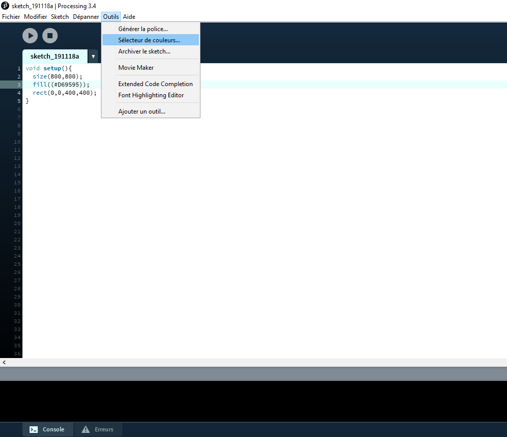
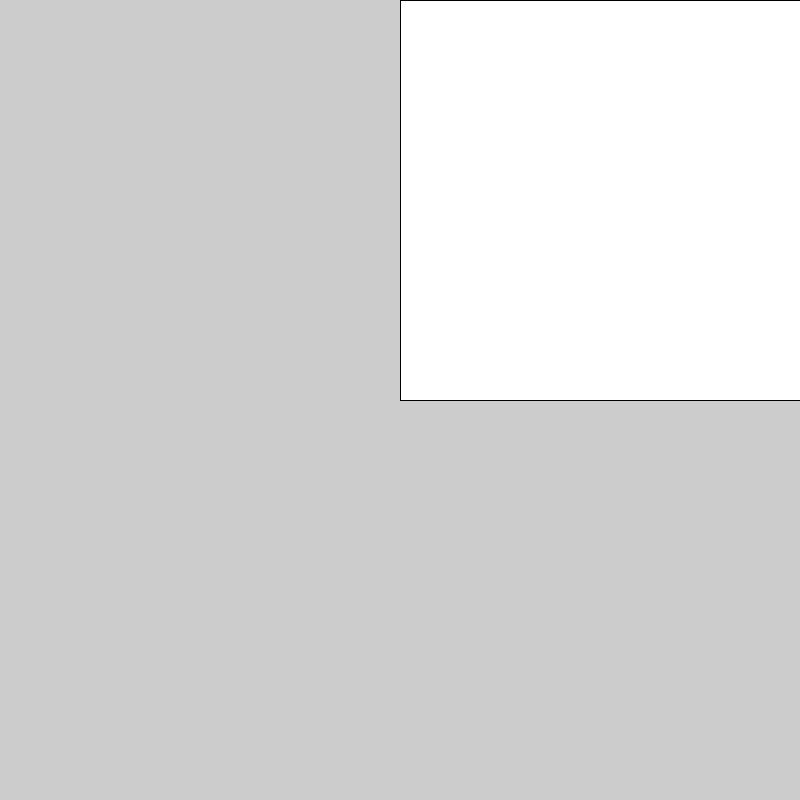

# Dessiner avec la programmation

Aujourd'hui on va faire un peu de dessin ! 
On va commencer de zéro, avec juste le code ci-dessous pour créer une fenêtre de 800 par 800 pixels :

```java
void setup(){
  size(800,800);
  // Le code de dessin viendra ici
}
```

Tout ce que vous avez besoin de savoir pour aujourd'hui :
  * pour dessiner un rectangle, c'est "rect(x, y , largeur, hauteur);" 
  
  :warning: x et y c'est les coordonnées du coin en haut à gauche du rectangle, et le point (0, 0) ça correspond au coin en haut à gauche de la fenêtre de dessin.
  * pour choisir la couleur, avant la ligne "rect(x, y , largeur, hauteur);", il faut taper "fill(#D69595);" où le nombre, par exemple #D69595, on l'obtient grâce à l'outils sélecteur de couleur :
  <p align="left">
  
  </p>
  
Et maintenant c'est parti ! Voilà plein de dessins, essayez de les reproduire :wink:

  <p align="left">
  
  </p>
  
  <p align="left">
  
  </p>
  
  <p align="left">
  
  </p>
  
  <p align="left">
  
  </p>
  
  <p align="left">
  
  </p>
  
  <p align="left">
  
  </p>
  
  <p align="left">
  
  </p>
  
  <p align="left">
  
  </p>
  
  <p align="left">
  
  </p>
  
  <p align="left">
  
  </p>
